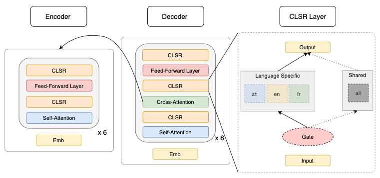

# Share or Not? Learning to Schedule Language-Specific Capacity for Multilingual Translation (Zhang et al., ICLR2021)

[**Paper**](https://openreview.net/forum?id=Wj4ODo0uyCF) | 
[**Highlights**](#paper-highlights) |
[**Overview**](#model-visualization) |
[**ModelRelease**](#pretrained-models-and-analysis-scripts) |
[**DataProcess**](#data-preprocessing) |
[**Training&Eval**](#training-and-evaluation) |
[**Citation**](#citation)

This repository contains source code, pretrained models, and also analysis script for our [ICLR21 CLSR paper](https://openreview.net/forum?id=Wj4ODo0uyCF). 

## Paper Highlights

We study how to distribute task (language) specific and task-shared parameters in multilingual Transformers. 

- We propose:
    * Conditional language-specific routing, a self-contained layer that can be plugged into a multilingual (multi-task) Transformer that learns to route per-token computation between two paths: shared or not.
    * Trained end-to-end with a compute budget regularizer, not only it improves the overall translation quality, but also allows us to investigate the learning dynamics of the models.

- We find that:
    * Both the amount and the position of language-specific layers matter for multilingual transformers. The best performance is achieved by distributing 10%-30% language-specific computation to the top and/or bottom encoder/decoder layers.
    * Feed-forward sub-layers utilize more language-specific capacity compared to other sub-layers on one-to-many translation. 
    * One-to-many translation benefits more from target language-specific parameters compared to many-to-one translation with source language-specific parameters, particularly when the training data is imbalanced.

## Model Visualization



As shown above, we insert a CLSR layer after every transformer sub-layer in the encoder and the decoder. 

Each CLSR layer assigns each token with a **scalar, binary, parameterized** gate {0, 1}:
* open gate routes information through language-specific path;
* while closed gate goes with shared path;

We control the proportion of open gates via a budget constraint: |Average(all gates) - p| with p a hyperparameter. 

Intuitively, smaller p enforces fewer open gates, *or less language-specific computation*. By decreasing p, CLSR will automatically schedule language-specific computation to critical sub-layers, thus offering us a change for better understanding.


## Pretrained Models and Analysis Scripts

**Note the data and models are not available yet**

* Pretrained models are available at [Google Driver](?) with the following directory structure:
```
models
├── opus-100-m2o
│   ├── original
│   │   ├── baseline
│   │   ├── ccts
│   │   └── ls
│   └── oversample
│       ├── baseline
│       ├── ccts
│       └── ls
├── opus-100-o2m
│   ├── original
│   │   ├── baseline
│   │   ├── ccts
│   │   └── ls
│   └── oversample
│       ├── baseline
│       ├── ccts
│       └── ls
├── readme
├── wmt-14-m2o
│   ├── original
│   │   ├── baseline
│   │   ├── ccts
│   │   └── ls
│   └── oversample
│       ├── baseline
│       ├── ccts
│       └── ls
└── wmt-14-o2m
    ├── original
    │   ├── baseline
    │   ├── ccts
    │   └── ls
    └── oversample
        ├── baseline
        ├── ccts
        └── ls
```
where `ls` denotes the language-specific modeling proposed in [the ACL2020 paper](https://www.aclweb.org/anthology/2020.acl-main.148/).

* Decoding script that uses the above pretrained models to produce translations and gates are available at [Here](?). 
    * This takes a long time, and it will generate results like [Here](?).
* Analysis script used in our paper is at [Here](?).
    * This will produce the figures in our paper.


## Requirement

The source code is based on older version of python and tensorflow.

- python==2.7
- tensorflow==1.13.1


## Data Preprocessing

This source code is adapted from [zero](https://github.com/bzhangGo/zero), and the preprocessing also follows zero.
[Here](https://github.com/bzhangGo/zero/tree/master/docs/usage#how-to-use-it) shows an typical example on how to 
preprocess the WMT14 En-De translation task. 
A [multilingual preprocessing example](https://github.com/bzhangGo/zero/tree/master/docs/multilingual_laln_lalt#data-preprocessing) 
is also available for OPUS-100.

In our multilingual setup, we append a target language tag, like "<2zh>", "<2fr>", to the source sentence in the first position.
We then concatenate the corpora of different language pairs together into one big file for model training. We adopt sentencepiece
to handle vocabularies.

Below we show some samples from our corpus (in OPUS-100 experiments):

| Type      | Examples                                                                                                                                                                           |
|-----------|------------------------------------------------------------------------------------------------------------------------------------------------------------------------------------|
| Source    | <2es> ▁You ' ve ▁been ▁dis loy al , ▁Paul .<br><2zh> ▁Paragraph ▁6 ▁of ▁Article ▁18 ▁states ▁that :<br><2ar> ▁Happy ▁to ▁have ▁the ▁place ▁to ▁yourself ?<br><2tr> ▁An ▁investor ? |
| Reference | ▁Has ▁sido ▁des le al , ▁Paul .<br>▁3. ▁第 18 条 第 6 款 规定 :<br>▁س عيد ▁أن ▁يكون ▁الم كان ▁المنا سب ▁لن فس ك ؟<br>▁Y at ırım cı ▁ha ?                                           |

**Note**:
* After subword preprocessing, either with [subword-nmt](https://github.com/rsennrich/subword-nmt) or [sentencepiece](https://github.com/google/sentencepiece), 
you need to re-generate the vocabulary in the format required by this codebase. 
    * e.g. `python vocab.py train.en vocab.zero.en`
* For language-specific modeling, you also need a language vocabulary that includes all these symbols `<2es>, <2fr>, <2ro>`.

## Training and Evaluation

* Below is a training script example, I also show some explanations about these hyperparameters.
    * or, instead, you could go to [config.py](config.py) for more details
```
data_path=preprocessed_data_directory

saved_dirs=output_dir="model_output_directory",tboard_dir="tboard_output_directory"
transformer_setting=hidden_size=512,embed_size=512,filter_size=2048,num_heads=8,num_encoder_layer=6,num_decoder_layer=6
dropout_ls=dropout=0.1,attention_dropout=0.1,relu_dropout=0.1,label_smooth=0.1
batch_size_sample_length=max_len=100,batch_size=60,batch_or_token='batch',eval_batch_size=8,eval_max_len=100,decode_max_length=128
initializer=initializer="uniform_unit_scaling",initializer_gain=1.

# see the model in 'models` folder
model=model_name="transformer_multilingual_clsr",scope_name="transformer_multilingual",buffer_size=600000,use_lang_specific_modeling=True

# clsr setting: cct_bucket_p is the hyperparameter controlling the open gate proportion
clsr_setting=cct_alpha_value=5.0,cct_relu_dim=128,cct_M=4,cct_bucket_p=0.5
data_loading_setting=input_queue_size=50000,output_queue_size=50000,tpu_queue_size=50000,process_num=3,epoches=5000

# tpu configuration: set use_tpu=False if you use GPU instead. iterations_per_loop: feed these batches of data to TPU side for computation
tpu_config=use_tpu=True,tpu_name="my_tpu_name",tpu_zone="europe-west4-a",tpu_project="my_tpu_project",iterations_per_loop=200
optimizer=update_cycle=1,clip_grad_norm=0.0,lrate=1.0,beta1=0.9,beta2=0.98,warmup_steps=4000,lrate_strategy="noam",epsilon=1e-8
running_settings=disp_freq=1000,eval_freq=5000,sample_freq=1000,checkpoints=5,max_training_steps=600000

# vocabularies and files
vocabulary=src_vocab_file="$data_path/vocab.zero.src",tgt_vocab_file="$data_path/vocab.zero.tgt",to_lang_vocab_file="$data_path/vocab.zero.lang"
files=src_train_file="$data_path/train.src.shuf",tgt_train_file="$data_path/train.tgt.shuf",src_dev_file="$data_path/dev.src",tgt_dev_file="$data_path/dev.tgt"

python run.py --mode train --parameters=\
$saved_dirs,\
$transformer_setting,\
$dropout_ls,\
$batch_size_sample_length,\
$initializer,\
$model,\
$clsr_setting,\
$data_loading_setting,\
$tpu_config,\
$optimizer,\
$running_settings,\
random_seed=1234,\
$vocabulary,\
$files
```

For CLSR model training, you need to run several experiments with different settings for `cct_bucket_p`.
Please check out [the model](models/transformer_multilingual_clsr.py) for more details regarding how these hyperparameters are used in the model.

Notice that: although the codebase support checkpoint saving/loading from either GCP or local storage, I suggest to save/load from the same storage.
For example, when running with GPUs, save your models on local storage; when using TPUs, use GCP instead.

* For evaluation, it follow a similar form. You need do the following two steps:
    * Firstly, perform checkpoint averaging to get a more robust model: 
    `python scripts/checkpoint_averaging.py --checkpoints 5 --output avg --path model_path --gpu 0`
    * Then, change `--mode train` to `--mode test`, and offer `src_test_file` for decoding.

[Here](?) shows an example how to perform decoding with our pretrained models.

## Known Problems
- The source code still have some problems with TPU training/decoding. For example,  
sometimes job stopped due to `Socket Closed`. This might be caused by TPU-side OOM or
network connection instability problem.
- Data loading and feeding part is suboptimal. This blocks running, and causes inefficient running.


## Citation

If you draw any inspiration from our study, please consider to cite our paper: 
```
@inproceedings{zhang2021share,
    title={Share or Not? Learning to Schedule Language-Specific Capacity for Multilingual Translation},
    author={Biao Zhang and Ankur Bapna and Rico Sennrich and Orhan Firat},
    booktitle={International Conference on Learning Representations},
    year={2021},
    url={https://openreview.net/forum?id=Wj4ODo0uyCF}
}
```
