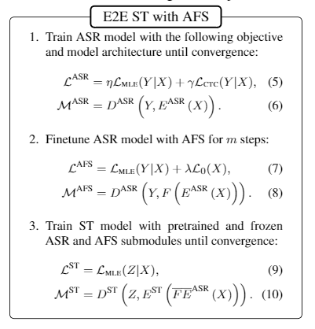
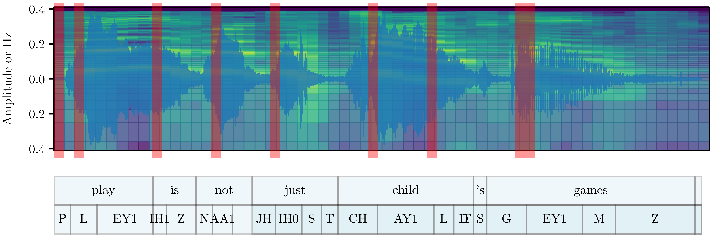

## Adaptive Feature Selection for End-to-End Speech Translation, EMNLP2020 Findings

- [paper link](https://arxiv.org/abs/2010.08518)
- source code is given in the [speech_translation branch](https://github.com/bzhangGo/zero/tree/speech_translation)

This paper targets at improving end-to-end speech translation by improving the quality of speech features through
feature selection. We argue that speech signals are often noisy and lengthy, involving large amount of redundant signals
contributing little to speech recognition, thus also speech translation. Our solution is to eschew those 
transcript-irrelevant features such that speech translation models could access more meaningful speech signals, easing the 
learning of speech-target translation correspondence/alignment.


We propose `adaptive feature selection`, based on [L0Drop](https://arxiv.org/abs/2004.11854), that learns to route information
through a subset of speech features to support speech tasks. The learning process is automatic, with some hyperparameter
controlling the degree of sparsity induced. Figure below shows the training procedure with AFS:



And the example below shows the position of selected features used for 
speech translation:



In our experiments, we observe substantial BLEU improvement compared against an ASR-pretrained ST baseline, where our
method filters out ~85% speech features (~1.4x decoding speedup as a by-product).

**In short, our work demonstrates that E2E ST suffers from redundant speech features, with sparsification bringing 
significant performance improvements. 
The E2E ST task offers new opportunities for follow-up research in sparse models to deliver performance gains, apart 
from enhancing efficiency and/or interpretability.**


### Model Training & Evaluation

Please go to the [speech_translation branch](https://github.com/bzhangGo/zero/tree/speech_translation) for more details,
where we provide an example for training/evaluation.


### Performance and Download

We provide [pretrained models](http://data.statmt.org/bzhang/emnlp2020_findings_afs_e2est) for MuST-C En-De and 
LibriSpeech En-Fr. We also provide our models' translation for each test set.


#### Results on MuST-C 

* BLEU Score and sparsity on MuST-C corpus. Our model outperforms baselines substantially. 

| Metric        | Model     | De     | Es     | Fr     | It     | Nl     | Pt     | Ro     | Ru    |
|---------------|-----------|--------|--------|--------|--------|--------|--------|--------|-------|
| BLEU          | ST        | 17.44  | 23.85  | 28.43  | 19.54  | 21.23  | 22.55  | 17.66  | 12.10 |
|               | ST+ASR-PT | 20.67  | 25.96  | 32.24  | 20.84  | 23.27  | 24.83  | 19.94  | 13.96 |
|               | ST+AFS-t  | 21.57  | 26.78  | 33.34  | 23.08  | 24.68  | 26.13  | 21.73  | 15.10 |
|               | ST+AFS-tf | 22.38  | 27.04  | 33.43  | 23.35  | 25.05  | 26.55  | 21.87  | 14.92 |
| Sparsity Rate | ST+AFS-t  | 84.4%  | 84.5%  | 83.2%  | 84.9%  | 84.4%  | 84.4%  | 84.7%  | 84.2% |
|               | ST+AFS-tf | 85.1%  | 84.5%  | 84.7%  | 84.9%  | 83.5%  | 85.1%  | 84.8%  | 84.7% |

* We offer models' translations to ease direct comparision for follow-up studies.

| Model     | De                                                                                                 | Es                                                                                                 | Fr                                                                                                 | It                                                                                                 | Nl                                                                                                 | Pt                                                                                                 | Ro                                                                                                 | Ru                                                                                                 |
|-----------|----------------------------------------------------------------------------------------------------|----------------------------------------------------------------------------------------------------|----------------------------------------------------------------------------------------------------|----------------------------------------------------------------------------------------------------|----------------------------------------------------------------------------------------------------|----------------------------------------------------------------------------------------------------|----------------------------------------------------------------------------------------------------|----------------------------------------------------------------------------------------------------|
| ST        | [txt](http://data.statmt.org/bzhang/emnlp2020_findings_afs_e2est/MuST-C/De/st/trans.tok.txt)       | [txt](http://data.statmt.org/bzhang/emnlp2020_findings_afs_e2est/MuST-C/Es/st/trans.tok.txt)       | [txt](http://data.statmt.org/bzhang/emnlp2020_findings_afs_e2est/MuST-C/Fr/st/trans.tok.txt)       | [txt](http://data.statmt.org/bzhang/emnlp2020_findings_afs_e2est/MuST-C/It/st/trans.tok.txt)       | [txt](http://data.statmt.org/bzhang/emnlp2020_findings_afs_e2est/MuST-C/Nl/st/trans.tok.txt)       | [txt](http://data.statmt.org/bzhang/emnlp2020_findings_afs_e2est/MuST-C/Pt/st/trans.tok.txt)       | [txt](http://data.statmt.org/bzhang/emnlp2020_findings_afs_e2est/MuST-C/Ro/st/trans.tok.txt)       | [txt](http://data.statmt.org/bzhang/emnlp2020_findings_afs_e2est/MuST-C/Ru/st/trans.tok.txt)       |
| ST+ASR-PT | [txt](http://data.statmt.org/bzhang/emnlp2020_findings_afs_e2est/MuST-C/De/st-asrpt/trans.tok.txt) | [txt](http://data.statmt.org/bzhang/emnlp2020_findings_afs_e2est/MuST-C/Es/st-asrpt/trans.tok.txt) | [txt](http://data.statmt.org/bzhang/emnlp2020_findings_afs_e2est/MuST-C/Fr/st-asrpt/trans.tok.txt) | [txt](http://data.statmt.org/bzhang/emnlp2020_findings_afs_e2est/MuST-C/It/st-asrpt/trans.tok.txt) | [txt](http://data.statmt.org/bzhang/emnlp2020_findings_afs_e2est/MuST-C/Nl/st-asrpt/trans.tok.txt) | [txt](http://data.statmt.org/bzhang/emnlp2020_findings_afs_e2est/MuST-C/Pt/st-asrpt/trans.tok.txt) | [txt](http://data.statmt.org/bzhang/emnlp2020_findings_afs_e2est/MuST-C/Ro/st-asrpt/trans.tok.txt) | [txt](http://data.statmt.org/bzhang/emnlp2020_findings_afs_e2est/MuST-C/Ru/st-asrpt/trans.tok.txt) |
| ST+AFS-t  | [txt](http://data.statmt.org/bzhang/emnlp2020_findings_afs_e2est/MuST-C/De/afs-t/trans.tok.txt)    | [txt](http://data.statmt.org/bzhang/emnlp2020_findings_afs_e2est/MuST-C/Es/afs-t/trans.tok.txt)    | [txt](http://data.statmt.org/bzhang/emnlp2020_findings_afs_e2est/MuST-C/Fr/afs-t/trans.tok.txt)    | [txt](http://data.statmt.org/bzhang/emnlp2020_findings_afs_e2est/MuST-C/It/afs-t/trans.tok.txt)    | [txt](http://data.statmt.org/bzhang/emnlp2020_findings_afs_e2est/MuST-C/Nl/afs-t/trans.tok.txt)    | [txt](http://data.statmt.org/bzhang/emnlp2020_findings_afs_e2est/MuST-C/Pt/afs-t/trans.tok.txt)    | [txt](http://data.statmt.org/bzhang/emnlp2020_findings_afs_e2est/MuST-C/Ro/afs-t/trans.tok.txt)    | [txt](http://data.statmt.org/bzhang/emnlp2020_findings_afs_e2est/MuST-C/Ru/afs-t/trans.tok.txt)    |
| ST+AFS-tf | [txt](http://data.statmt.org/bzhang/emnlp2020_findings_afs_e2est/MuST-C/De/afs-tf/trans.tok.txt)   | [txt](http://data.statmt.org/bzhang/emnlp2020_findings_afs_e2est/MuST-C/Es/afs-tf/trans.tok.txt)   | [txt](http://data.statmt.org/bzhang/emnlp2020_findings_afs_e2est/MuST-C/Fr/afs-tf/trans.tok.txt)   | [txt](http://data.statmt.org/bzhang/emnlp2020_findings_afs_e2est/MuST-C/It/afs-tf/trans.tok.txt)   | [txt](http://data.statmt.org/bzhang/emnlp2020_findings_afs_e2est/MuST-C/Nl/afs-tf/trans.tok.txt)   | [txt](http://data.statmt.org/bzhang/emnlp2020_findings_afs_e2est/MuST-C/Pt/afs-tf/trans.tok.txt)   | [txt](http://data.statmt.org/bzhang/emnlp2020_findings_afs_e2est/MuST-C/Ro/afs-tf/trans.tok.txt)   | [txt](http://data.statmt.org/bzhang/emnlp2020_findings_afs_e2est/MuST-C/Ru/afs-tf/trans.tok.txt)   |

* For MuST-C En-De, we also provide the [preprocessed dataset, very large ~66G](http://data.statmt.org/bzhang/emnlp2020_findings_afs_e2est/MuST-C-EnDe/Corpus/data.tar.gz)
 for downloading. Besides, we provide the trained models below.

| Model     | MuST-C EnDe                                                                                                     |
|-----------|--------------------------------------------------------------------------------------------------------|
| ST        | [model](http://data.statmt.org/bzhang/emnlp2020_findings_afs_e2est/MuST-C-EnDe/Models/st.tar.gz)       |
| ST+ASR-PT | [model](http://data.statmt.org/bzhang/emnlp2020_findings_afs_e2est/MuST-C-EnDe/Models/st-asrpt.tar.gz) |
| ST+AFS-t  | [model](http://data.statmt.org/bzhang/emnlp2020_findings_afs_e2est/MuST-C-EnDe/Models/afs-t.tar.gz)    |
| ST+AFS-tf | [model](http://data.statmt.org/bzhang/emnlp2020_findings_afs_e2est/MuST-C-EnDe/Models/afs-tf.tar.gz)   |


#### Results on LibriSpeech En-Fr

Similar to MuST-C, we provide [preprocessed dataset, ~16G](http://data.statmt.org/bzhang/emnlp2020_findings_afs_e2est/LibriSpeech-EnFr/Corpus/data.tar.gz),
translation performance, translation output and pretrained models.

| Model     | LibriSpeech EnFr                                                                                                                                                                                                                    |
|-----------|-------------------------------------------------------------------------------------------------------------------------------------------------------------------------------------------------------------------------------------|
| ST        | 14.32 [txt](http://data.statmt.org/bzhang/emnlp2020_findings_afs_e2est/LibriSpeech-EnFr/Outputs/st/trans.tok.txt) [model](http://data.statmt.org/bzhang/emnlp2020_findings_afs_e2est/LibriSpeech-EnFr/Models/st.tar.gz)             |
| ST+ASR-PT | 17.05 [txt](http://data.statmt.org/bzhang/emnlp2020_findings_afs_e2est/LibriSpeech-EnFr/Outputs/st-asrpt/trans.tok.txt) [model](http://data.statmt.org/bzhang/emnlp2020_findings_afs_e2est/LibriSpeech-EnFr/Models/st-asrpt.tar.gz) |
| ST+AFS-t  | 18.33 [txt](http://data.statmt.org/bzhang/emnlp2020_findings_afs_e2est/LibriSpeech-EnFr/Outputs/afs-t/trans.tok.txt) [model](http://data.statmt.org/bzhang/emnlp2020_findings_afs_e2est/LibriSpeech-EnFr/Models/afs-t.tar.gz)       |
| ST+AFS-tf | 18.56 [txt](http://data.statmt.org/bzhang/emnlp2020_findings_afs_e2est/LibriSpeech-EnFr/Outputs/afs-tf/trans.tok.txt) [model](http://data.statmt.org/bzhang/emnlp2020_findings_afs_e2est/LibriSpeech-EnFr/Models/afs-tf.tar.gz)     |


Please go to [AFS for E2E ST](http://data.statmt.org/bzhang/emnlp2020_findings_afs_e2est/) for more details.

### Citation

Please consider cite our paper as follows:
>Biao Zhang; Ivan Titov; Barry Haddow; Rico Sennrich (2020). Adaptive Feature Selection for End-to-End Speech Translation. In Findings of EMNLP. 
```
@inproceedings{zhang-etal-2020-adaptive,
    title = "Adaptive Feature Selection for End-to-End Speech Translation",
    author = "Zhang, Biao  and
      Titov, Ivan  and
      Haddow, Barry and
      Sennrich, Rico",
    booktitle = "Findings of EMNLP",
    year = "2020",
}
```
