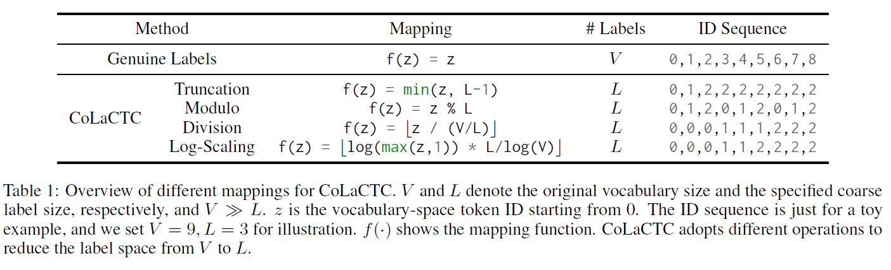
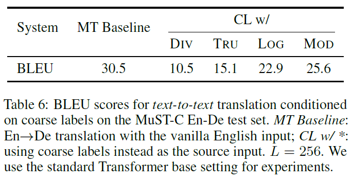

## Efficient CTC Regularization via Coarse Labels for End-to-End Speech Translation, EACL 2023

- [paper link]()
- source code is available at [st_from_scratch](https://github.com/bzhangGo/st_from_scratch)

**Why CTC Regularization?**

Speech translation (ST) requires the model to capture the semantics of an audio input, 
but auido carries many content-irrelevant information, such as emotion and pauses, that increases the
difficulty of translation modeling.

CTC Regularization offers a mechanism to dynamically align speech representations with their 
discrete labels, down-weighting content-irrelevant information and encouraging the learning of speech semantics. In the 
literature, many studies have confirmed its effectiveness on ST.


**Why NOT CTC Regularization?**

CTC Regularization requires an extra projection layer similar to the word prediction layer, which bringins in 
many model parameters and slows the running.

We are particularly interested in improving the efficiency of CTC Regularization.


**CoLaCTC**

*Why use genuine labels for CTC regulariation?* particularly considering the CTC regularizaiton layer will be dropped
after training.

Following this idea, we propose to use pseudo CTC labels at coarser grain for CTC regularization, which offers a direct
control over the CTC space and decoupled this space with the genuine word vocabulary space. 
We only used some simple operations to produce CoLaCTC labels as follows:



**How does it work?**


| System                                                | Params | BLEU | Speedup |
|-------------------------------------------------------|--------|------|---------|
| Baseline (no CTC)                                     | 46.1M  | 21.8 | 1.39x   |
| CTC Regularization + translation labels               | 47.9M  | 22.7 | 1.00x   |
| CTC Regularization + translation-based CoLaCTC labels | 46.2M  | 22.7 | 1.39x   |
| CTC Regularization + transcript labels                | 47.5M  | 23.8 | 1.00x   |
| CTC Regularization + transcript-based CoLaCTC labels  | 46.2M  | 24.3 | 1.31x   |

(Quality on MuST-C En-De)

**Why does it work?**

We are still lack of understanding on why it could work so well on ST. One observation is that CoLaCTC label sequence is 
still quite informative. Using it as the source input for machine translation could achieve decent
performance:



### Model Training & Evaluation

We added the implementation to [st_from_scratch](https://github.com/bzhangGo/st_from_scratch). The implementation is
quite simple.
We change
```python
  seq_values.extend(sequence)
```
to
```python
  seq_values.extend([v % self.p.cola_ctc_L for v in sequence])
```
as in https://github.com/bzhangGo/st_from_scratch/blob/master/data.py#L152


### Citation

Please consider cite our paper as follows:
>Biao Zhang; Barry Haddow; Rico Sennrich (2023). Efficient CTC Regularization via Coarse Labels for End-to-End Speech Translation. In EACL 2023. 
```
@inproceedings{zhang-etal-2023-colactc,
    title = "Efficient CTC Regularization via Coarse Labels for End-to-End Speech Translation",
    author = "Zhang, Biao  and
      Haddow, Barry  and
      Sennrich, Rico",
    booktitle = "Proceedings of the 17th Conference of the European Chapter of the Association for Computational Linguistics: Main Volume",
    month = may,
    year = "2023",
    publisher = "Association for Computational Linguistics",
}
```
