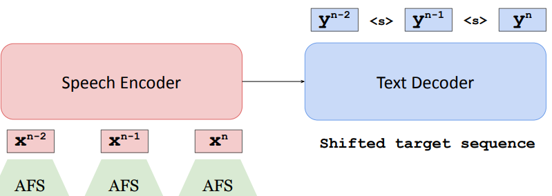
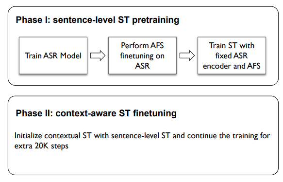

## Beyond Sentence-Level End-to-End Speech Translation: Context Helps

[**Paper**](https://aclanthology.org/2021.acl-long.200/) | 
[**Highlights**](#paper-highlights) |
[**Overview**](#context_aware_st) |
[**Results**](#results) |
[**Training&Eval**](#training-and-evaluation) |
[**Citation**](#citation)

### Paper highlights

Contextual information carries valuable clues for translation. So far, studies on text-based context-aware translation have shown
success, but whether and how context helps end-to-end speech question is still under-studied.

We believe that context would be more helpful to ST, because speech signals often contain more ambiguous expressions apart 
from the ones commonly occurred in texts. For example, homophones, like flower and flour, are almost indistinguishable without context.

We study context-aware ST in this project and using a simple concatenation-based model. Our main findings are as follows:
* Incorporating context improves overall translation quality (+0.18-2.61 BLEU) and benefits pronoun translation across different language pairs. 
* Context also improves the translation of homophones
* ST models with contexts suffer less from (artificial) audio segmentation errors
* Contextual modeling improves translation quality and reduces latency and flicker for simultaneous translation under re-translation strategy


### Overview

We use AFS to reduce the audio feature length and improve training efficiency. Figure below shows our overall framework:



Note creating novel context-aware ST architectures is not the key topic of this study, which is our next-step study.


### Training and Evaluation

- We implement the model in [context-aware speech_translation branch](https://github.com/bzhangGo/zero/tree/context_aware_speech_translation)

Our training involves two phrases, as shown below:



Please refer to [our paper](https://aclanthology.org/2021.acl-long.200/) for more details.


### Results

We mainly experiment with MuST-C corpus and below we show our model outputs (also BLEU) in all languages.

| Model         | De                                                                              | Es                                                                              | Fr                                                                              | It                                                                              | Nl                                                                              | Pt                                                                              | Ro                                                                              | Ru                                                                              |
|---------------|---------------------------------------------------------------------------------|---------------------------------------------------------------------------------|---------------------------------------------------------------------------------|---------------------------------------------------------------------------------|---------------------------------------------------------------------------------|---------------------------------------------------------------------------------|---------------------------------------------------------------------------------|---------------------------------------------------------------------------------|
| Baseline      | [22.38](http://data.statmt.org/bzhang/acl2021_context_aware_st/baseline/de.txt) | [27.04](http://data.statmt.org/bzhang/acl2021_context_aware_st/baseline/es.txt) | [33.43](http://data.statmt.org/bzhang/acl2021_context_aware_st/baseline/fr.txt) | [23.35](http://data.statmt.org/bzhang/acl2021_context_aware_st/baseline/it.txt) | [25.05](http://data.statmt.org/bzhang/acl2021_context_aware_st/baseline/nl.txt) | [26.55](http://data.statmt.org/bzhang/acl2021_context_aware_st/baseline/pt.txt) | [21.87](http://data.statmt.org/bzhang/acl2021_context_aware_st/baseline/ro.txt) | [14.92](http://data.statmt.org/bzhang/acl2021_context_aware_st/baseline/ru.txt) |
| CA ST w/ SWBD |      [22.7](http://data.statmt.org/bzhang/acl2021_context_aware_st/swbd/de.txt) |     [27.12](http://data.statmt.org/bzhang/acl2021_context_aware_st/swbd/es.txt) |     [34.23](http://data.statmt.org/bzhang/acl2021_context_aware_st/swbd/fr.txt) |     [23.46](http://data.statmt.org/bzhang/acl2021_context_aware_st/swbd/it.txt) |     [25.84](http://data.statmt.org/bzhang/acl2021_context_aware_st/swbd/nl.txt) |     [26.63](http://data.statmt.org/bzhang/acl2021_context_aware_st/swbd/pt.txt) |      [23.7](http://data.statmt.org/bzhang/acl2021_context_aware_st/swbd/ro.txt) |     [15.53](http://data.statmt.org/bzhang/acl2021_context_aware_st/swbd/ru.txt) |
| CA ST w/ IMED |     [22.86](http://data.statmt.org/bzhang/acl2021_context_aware_st/imed/de.txt) |      [27.5](http://data.statmt.org/bzhang/acl2021_context_aware_st/imed/es.txt) |     [34.28](http://data.statmt.org/bzhang/acl2021_context_aware_st/imed/fr.txt) |     [23.53](http://data.statmt.org/bzhang/acl2021_context_aware_st/imed/it.txt) |     [26.12](http://data.statmt.org/bzhang/acl2021_context_aware_st/imed/nl.txt) |     [27.37](http://data.statmt.org/bzhang/acl2021_context_aware_st/imed/pt.txt) |     [24.48](http://data.statmt.org/bzhang/acl2021_context_aware_st/imed/ro.txt) |     [15.95](http://data.statmt.org/bzhang/acl2021_context_aware_st/imed/ru.txt) |


### Citation

Please consider cite our paper as follows:
>Biao Zhang; Ivan Titov; Barry Haddow; Rico Sennrich (2021). Beyond Sentence-Level End-to-End Speech Translation: Context Helps. In Proceedings of the 59th Annual Meeting of the Association for Computational Linguistics and the 11th International Joint Conference on Natural Language Processing (Volume 1: Long Papers). 
```
@inproceedings{zhang-etal-2021-beyond,
    title = "Beyond Sentence-Level End-to-End Speech Translation: Context Helps",
    author = "Zhang, Biao  and
      Titov, Ivan  and
      Haddow, Barry  and
      Sennrich, Rico",
    booktitle = "Proceedings of the 59th Annual Meeting of the Association for Computational Linguistics and the 11th International Joint Conference on Natural Language Processing (Volume 1: Long Papers)",
    month = aug,
    year = "2021",
    address = "Online",
    publisher = "Association for Computational Linguistics",
    url = "https://aclanthology.org/2021.acl-long.200",
    doi = "10.18653/v1/2021.acl-long.200",
    pages = "2566--2578",
    abstract = "Document-level contextual information has shown benefits to text-based machine translation, but whether and how context helps end-to-end (E2E) speech translation (ST) is still under-studied. We fill this gap through extensive experiments using a simple concatenation-based context-aware ST model, paired with adaptive feature selection on speech encodings for computational efficiency. We investigate several decoding approaches, and introduce in-model ensemble decoding which jointly performs document- and sentence-level translation using the same model. Our results on the MuST-C benchmark with Transformer demonstrate the effectiveness of context to E2E ST. Compared to sentence-level ST, context-aware ST obtains better translation quality (+0.18-2.61 BLEU), improves pronoun and homophone translation, shows better robustness to (artificial) audio segmentation errors, and reduces latency and flicker to deliver higher quality for simultaneous translation.",
}
```