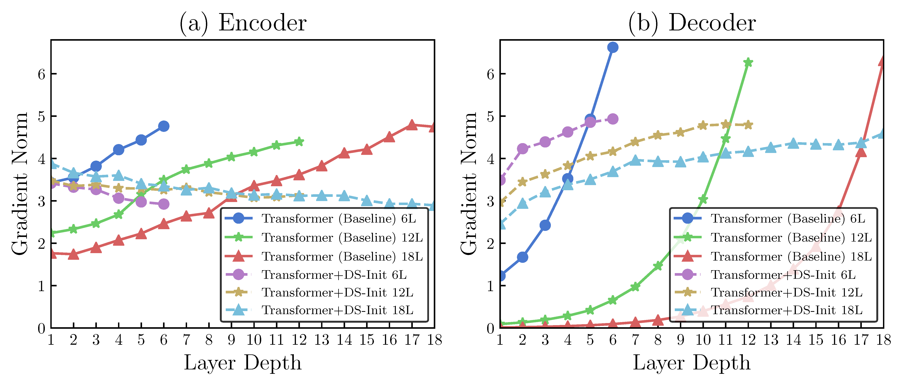
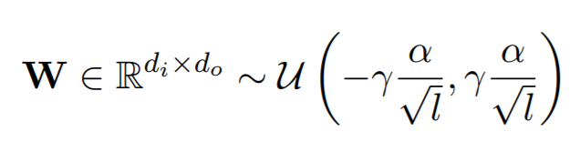

## Improving Deep Transformer with Depth-Scaled Initialization and Merged Attention, EMNLP2019

- [paper link](https://www.aclweb.org/anthology/D19-1083/)

This paper focus on improving Deep Transformer. 
Our empirical observation suggests that simply stacking more Transformer layers makes training divergent.
Rather than resorting to the pre-norm structure which shifts the layer normalization before modeling blocks,
we analyze the reason why a vanilla deep Transformer suffers from poor convergence.



Our evidence shows that it's because of *gradient vanishing* (shown above) caused by the interaction between residual connection
and layer normalization. **In short, the residual connection increases the variance of its output, which decreases the gradient
backpropagated from layer normalization. (empirically)**

We solve this problem by proposing depth-scaled initialization (DS-Init), which decreases 
parameter variance at the initialization stage. DS-Init reduces output variance of residual connections so as to
ease gradient back-propagation through normalization layers. In practice, DS-Init often produces slightly better
translation quality than the pre-norm structure.

We also care about the computational overhead raised by deep models. To settle this issue, we propose the merged
attention network which combines a simplified average attention model and the encoder-decoder attention model on 
the target side. Merged attention model enables the deep Transformer matching the decoding speed of its baseline
with a clear higher BLEU score.

### Approach

To train a deep Transformer model for machine translation, scale your initialization for each layer as follows:



where `\alpha` and `\gamma` are hyperparameters for the uniform distribution. `l` denotes the depth of the layer.


### Model Training

Train 12-layer Transformer model with the following settings:
>The model class is: `transformer_fuse`, the merged attention is enabled by giving `fuse_mask` into `dot_attention` function.
```
python run.py --mode train --parameters=hidden_size=512,embed_size=512,filter_size=2048,\
initializer="uniform_unit_scaling",initializer_gain=1.,\
model_name="transformer_fuse",scope_name="transformer_fuse",\
deep_transformer_init=True,\
num_encoder_layer=12,\
num_decoder_layer=12,\
```

Other details can be found [here](../usage).

### Performance and Download

We offer a range of [pretrained models](http://data.statmt.org/bzhang/emnlp19_deep_transformer/) for further study.


| Task          | Model                               | BLEU  | Download |
|---------------|-------------------------------------|-------| -------- |
| WMT14 En-Fr   | Base Transformer + 6 Layers         | 39.09 | |
|               | Base Transformer + Ours + 12 Layers | 40.58 | |
| IWSLT14 De-En | Base Transformer + 6 Layers         | 34.41 | |
|               | Base Transformer + Ours + 12 Layers | 35.63 | |
| WMT18 En-Fr   | Base Transformer + 6 Layers         | 15.5  | |
|               | Base Transformer + Ours + 12 Layers | 15.8  | |
| WMT18 Zh-En   | Base Transformer + 6 Layers         | 21.1  | |
|               | Base Transformer + Ours + 12 Layers | 22.3  | |
| WMT14 En-De   | Base Transformer + 6 Layers         | 27.59 | [download](http://data.statmt.org/bzhang/emnlp19_deep_transformer/model/base.tar.gz) |
|               | Base Transformer + Ours + 12 Layers | 28.55 | |
|               | Big Transformer + 6 Layers          | 29.07 | [download](http://data.statmt.org/bzhang/emnlp19_deep_transformer/model/big.tar.gz) |
|               | Big Transformer + Ours + 12 Layers  | 29.47 | |
|               | Base Transformer + Ours + 20 Layers | 28.67 | [download](http://data.statmt.org/bzhang/emnlp19_deep_transformer/model/base+fuse_init20.tar.gz) |
|               | Base Transformer + Ours + 30 Layers | 28.86 | [download](http://data.statmt.org/bzhang/emnlp19_deep_transformer/model/base+fuse_init30.tar.gz) |
|               | Big Transformer + Ours + 20 Layers  | 29.62 | [download](http://data.statmt.org/bzhang/emnlp19_deep_transformer/model/big+fuse_init20.tar.gz) |

Please go to [pretrained models](http://data.statmt.org/bzhang/emnlp19_deep_transformer/) for more details.

### Citation

Please consider cite our paper as follows:
>Biao Zhang; Ivan Titov; Rico Sennrich (2019). Improving Deep Transformer with Depth-Scaled Initialization and Merged Attention. In Proceedings of the 2019 Conference on Empirical Methods in Natural Language Processing and the 9th International Joint Conference on Natural Language Processing (EMNLP-IJCNLP). Hong Kong, China, pp. 898-909. 
```
@inproceedings{zhang-etal-2019-improving-deep,
    title = "Improving Deep Transformer with Depth-Scaled Initialization and Merged Attention",
    author = "Zhang, Biao  and
      Titov, Ivan  and
      Sennrich, Rico",
    booktitle = "Proceedings of the 2019 Conference on Empirical Methods in Natural Language Processing and the 9th International Joint Conference on Natural Language Processing (EMNLP-IJCNLP)",
    month = nov,
    year = "2019",
    address = "Hong Kong, China",
    publisher = "Association for Computational Linguistics",
    url = "https://www.aclweb.org/anthology/D19-1083",
    doi = "10.18653/v1/D19-1083",
    pages = "898--909",
    abstract = "The general trend in NLP is towards increasing model capacity and performance via deeper neural networks. However, simply stacking more layers of the popular Transformer architecture for machine translation results in poor convergence and high computational overhead. Our empirical analysis suggests that convergence is poor due to gradient vanishing caused by the interaction between residual connection and layer normalization. We propose depth-scaled initialization (DS-Init), which decreases parameter variance at the initialization stage, and reduces output variance of residual connections so as to ease gradient back-propagation through normalization layers. To address computational cost, we propose a merged attention sublayer (MAtt) which combines a simplified average-based self-attention sublayer and the encoder-decoder attention sublayer on the decoder side. Results on WMT and IWSLT translation tasks with five translation directions show that deep Transformers with DS-Init and MAtt can substantially outperform their base counterpart in terms of BLEU (+1.1 BLEU on average for 12-layer models), while matching the decoding speed of the baseline model thanks to the efficiency improvements of MAtt. Source code for reproduction will be released soon.",
}
```
