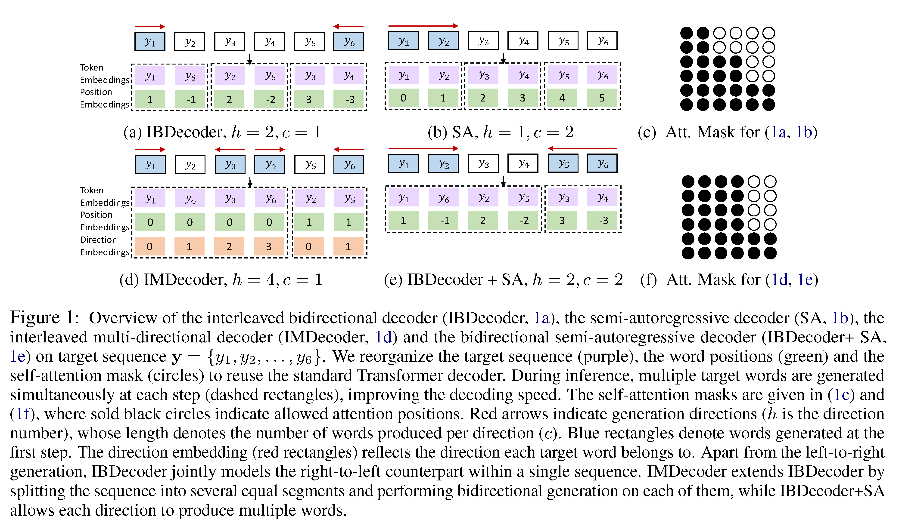

## Fast Interleaved Bidirectional Sequence Generation

- [paper link](https://arxiv.org/abs/2010.14481)
- source code is given in the [interleaved_bidirectional_transformer branch](https://github.com/bzhangGo/zero/tree/interleaved_bidirectional_transformer)


Sequence-to-sequence (seq2seq) models, Transformer in particular, still suffer from slow decoding due to the autoregressive decoding
constraint. Researchers thus attempt to relax this constraint by resorting to semi-to-non autoregressive modeling,
often gaining translation speedup but at the cost of model performance.

We follow this direction: trying to produce multiple target tokens per decoding step, with a specific focus on the 
semi-autoregressive (SA) modeling. One drawback of the vanilla SA model is that it imposes independence assumption on  
neighbouring target tokens, ignoring the fact that neighbouring words are often strongly correlated. By contrast,
we explore bidirectional generation from the left-to-right and the right-to-left simultaneously, and show evidence that 
the independence assumptions in our model are more felicitous.

We propose interleaved bidirectional decoder (IBDecoder), that interleaves target words from the left-to-right and 
right-to-left directions and separate their positions to support reusing any standard unidirectional decoders.
See figure below for illustration:



 
Our experiments on several seq2seq tasks, including machine translation and document summarization demonstrate the 
superiority of IBDecoder, yielding comparable performance against the autoregressive baseline 
without knowledge distillation with a speedup of ~2x. With knowledge distillation, IBDecoder achieves 4x-11x speedups
across different tasks at the cost of <1 BLEU or <0.5 ROUGE (on average) by producing more target tokens (beyond two) 
at each decoder step.


### Model Training & Evaluation

Please go to the [interleaved_bidirectional_transformer branch](https://github.com/bzhangGo/zero/tree/interleaved_bidirectional_transformer) for more details.
The source code is compatible with the master version: no need for specially preprocessing the corpus for bidirectional modeling.

### Performance and Download

We provide [pretrained models and preprocessed datasets](http://data.statmt.org/bzhang/wmt2020_interleaved_bidirectional_transformer) 
for all tasks we used. Below is the detailed results.


|                    |         | Model       | KD  | Machine Translation                                                                                                                                                                                                                                        |                                                                                                                                                                                                                                                            |                                                                                                                                                                                                                                                            |                                                                                                                                                                                                                                                            |                                                                                                                                                                                                                                                             | Document Summarization                                                                                                                                                                                                                                              |                                                                                                                                                                                                                                                                             |
|--------------------|---------|-------------|-----|------------------------------------------------------------------------------------------------------------------------------------------------------------------------------------------------------------------------------------------------------------|------------------------------------------------------------------------------------------------------------------------------------------------------------------------------------------------------------------------------------------------------------|------------------------------------------------------------------------------------------------------------------------------------------------------------------------------------------------------------------------------------------------------------|------------------------------------------------------------------------------------------------------------------------------------------------------------------------------------------------------------------------------------------------------------|-------------------------------------------------------------------------------------------------------------------------------------------------------------------------------------------------------------------------------------------------------------|---------------------------------------------------------------------------------------------------------------------------------------------------------------------------------------------------------------------------------------------------------------------|-----------------------------------------------------------------------------------------------------------------------------------------------------------------------------------------------------------------------------------------------------------------------------|
|                    |         |             |     | En-De                                                                                                                                                                                                                                                      | En-Fr                                                                                                                                                                                                                                                      | Ro-En                                                                                                                                                                                                                                                      | En-Ru                                                                                                                                                                                                                                                      | En-Ja                                                                                                                                                                                                                                                       | Gigaword                                                                                                                                                                                                                                                            | CNNDailyMail                                                                                                                                                                                                                                                                |
|                    | Data    |             |     | [download](http://data.statmt.org/bzhang/wmt2020_interleaved_bidirectional_transformer/MT-EnDe/corpus.tar.gz)                                                                                                                                              | [download](http://data.statmt.org/bzhang/wmt2020_interleaved_bidirectional_transformer/MT-EnFr/corpus.tar.gz)                                                                                                                                              | [download](http://data.statmt.org/bzhang/wmt2020_interleaved_bidirectional_transformer/MT-RoEn/corpus.tar.gz)                                                                                                                                              | [download](http://data.statmt.org/bzhang/wmt2020_interleaved_bidirectional_transformer/MT-EnRu/corpus.tar.gz)                                                                                                                                              | [download](http://data.statmt.org/bzhang/wmt2020_interleaved_bidirectional_transformer/MT-EnJa/corpus.tar.gz)                                                                                                                                               | [download](http://data.statmt.org/bzhang/wmt2020_interleaved_bidirectional_transformer/DS-Gigaword/corpus.tar.gz)                                                                                                                                                   | [download](http://data.statmt.org/bzhang/wmt2020_interleaved_bidirectional_transformer/DS-CNNDailyMail/corpus.tar.gz)                                                                                                                                                       |
| Beam Search (B= 4) | Quality | Transformer | no  | 26.9                                                                                                                                                                                                                                                       | 32.1                                                                                                                                                                                                                                                       | 32.7                                                                                                                                                                                                                                                       | 27.7                                                                                                                                                                                                                                                       | 43.97                                                                                                                                                                                                                                                       | 35.03                                                                                                                                                                                                                                                               | 36.88                                                                                                                                                                                                                                                                       |
|                    |         | IBDecoder   | no  | 26.2 [model](http://data.statmt.org/bzhang/wmt2020_interleaved_bidirectional_transformer/MT-EnDe/raw_ibdecoder/model.tar.gz) [txt](http://data.statmt.org/bzhang/wmt2020_interleaved_bidirectional_transformer/MT-EnDe/raw_ibdecoder/beam.trans.txt)       | 32.1 [model](http://data.statmt.org/bzhang/wmt2020_interleaved_bidirectional_transformer/MT-EnFr/raw_ibdecoder/model.tar.gz) [txt](http://data.statmt.org/bzhang/wmt2020_interleaved_bidirectional_transformer/MT-EnFr/raw_ibdecoder/beam.trans.txt)       | 33.3 [model](http://data.statmt.org/bzhang/wmt2020_interleaved_bidirectional_transformer/MT-RoEn/raw_ibdecoder/model.tar.gz) [txt](http://data.statmt.org/bzhang/wmt2020_interleaved_bidirectional_transformer/MT-RoEn/raw_ibdecoder/beam.trans.txt)       | 27.0 [model](http://data.statmt.org/bzhang/wmt2020_interleaved_bidirectional_transformer/MT-EnRu/raw_ibdecoder/model.tar.gz) [txt](http://data.statmt.org/bzhang/wmt2020_interleaved_bidirectional_transformer/MT-EnRu/raw_ibdecoder/beam.trans.txt)       | 43.51 [model](http://data.statmt.org/bzhang/wmt2020_interleaved_bidirectional_transformer/MT-EnJa/raw_ibdecoder/model.tar.gz) [txt](http://data.statmt.org/bzhang/wmt2020_interleaved_bidirectional_transformer/MT-EnJa/raw_ibdecoder/beam.trans.txt)       | 34.57 [model](http://data.statmt.org/bzhang/wmt2020_interleaved_bidirectional_transformer/DS-Gigaword/raw_ibdecoder/model.tar.gz) [txt](http://data.statmt.org/bzhang/wmt2020_interleaved_bidirectional_transformer/DS-Gigaword/raw_ibdecoder/beam.trans.txt)       | 36.11 [model](http://data.statmt.org/bzhang/wmt2020_interleaved_bidirectional_transformer/DS-CNNDailyMail/raw_ibdecoder/model.tar.gz) [txt](http://data.statmt.org/bzhang/wmt2020_interleaved_bidirectional_transformer/DS-CNNDailyMail/raw_ibdecoder/beam.trans.txt)       |
|                    |         | +SA         | no  | 23.0 [model](http://data.statmt.org/bzhang/wmt2020_interleaved_bidirectional_transformer/MT-EnDe/raw_ibdecoder_sa/model.tar.gz) [txt](http://data.statmt.org/bzhang/wmt2020_interleaved_bidirectional_transformer/MT-EnDe/raw_ibdecoder_sa/beam.trans.txt) | 30.3 [model](http://data.statmt.org/bzhang/wmt2020_interleaved_bidirectional_transformer/MT-EnFr/raw_ibdecoder_sa/model.tar.gz) [txt](http://data.statmt.org/bzhang/wmt2020_interleaved_bidirectional_transformer/MT-EnFr/raw_ibdecoder_sa/beam.trans.txt) | 31.3 [model](http://data.statmt.org/bzhang/wmt2020_interleaved_bidirectional_transformer/MT-RoEn/raw_ibdecoder_sa/model.tar.gz) [txt](http://data.statmt.org/bzhang/wmt2020_interleaved_bidirectional_transformer/MT-RoEn/raw_ibdecoder_sa/beam.trans.txt) | 25.0 [model](http://data.statmt.org/bzhang/wmt2020_interleaved_bidirectional_transformer/MT-EnRu/raw_ibdecoder_sa/model.tar.gz) [txt](http://data.statmt.org/bzhang/wmt2020_interleaved_bidirectional_transformer/MT-EnRu/raw_ibdecoder_sa/beam.trans.txt) | 41.75 [model](http://data.statmt.org/bzhang/wmt2020_interleaved_bidirectional_transformer/MT-EnJa/raw_ibdecoder_sa/model.tar.gz) [txt](http://data.statmt.org/bzhang/wmt2020_interleaved_bidirectional_transformer/MT-EnJa/raw_ibdecoder_sa/beam.trans.txt) | 33.65 [model](http://data.statmt.org/bzhang/wmt2020_interleaved_bidirectional_transformer/DS-Gigaword/raw_ibdecoder_sa/model.tar.gz) [txt](http://data.statmt.org/bzhang/wmt2020_interleaved_bidirectional_transformer/DS-Gigaword/raw_ibdecoder_sa/beam.trans.txt) | 35.27 [model](http://data.statmt.org/bzhang/wmt2020_interleaved_bidirectional_transformer/DS-CNNDailyMail/raw_ibdecoder_sa/model.tar.gz) [txt](http://data.statmt.org/bzhang/wmt2020_interleaved_bidirectional_transformer/DS-CNNDailyMail/raw_ibdecoder_sa/beam.trans.txt) |
|                    |         | IBDecoder   | yes | 27.1 [model](http://data.statmt.org/bzhang/wmt2020_interleaved_bidirectional_transformer/MT-EnDe/kd_ibdecoder/model.tar.gz) [txt](http://data.statmt.org/bzhang/wmt2020_interleaved_bidirectional_transformer/MT-EnDe/kd_ibdecoder/beam.trans.txt)         | 32.7 [model](http://data.statmt.org/bzhang/wmt2020_interleaved_bidirectional_transformer/MT-EnFr/kd_ibdecoder/model.tar.gz) [txt](http://data.statmt.org/bzhang/wmt2020_interleaved_bidirectional_transformer/MT-EnFr/kd_ibdecoder/beam.trans.txt)         | 33.5 [model](http://data.statmt.org/bzhang/wmt2020_interleaved_bidirectional_transformer/MT-RoEn/kd_ibdecoder/model.tar.gz) [txt](http://data.statmt.org/bzhang/wmt2020_interleaved_bidirectional_transformer/MT-RoEn/kd_ibdecoder/beam.trans.txt)         | 27.5 [model](http://data.statmt.org/bzhang/wmt2020_interleaved_bidirectional_transformer/MT-EnRu/kd_ibdecoder/model.tar.gz) [txt](http://data.statmt.org/bzhang/wmt2020_interleaved_bidirectional_transformer/MT-EnRu/kd_ibdecoder/beam.trans.txt)         | 43.76 [model](http://data.statmt.org/bzhang/wmt2020_interleaved_bidirectional_transformer/MT-EnJa/kd_ibdecoder/model.tar.gz) [txt](http://data.statmt.org/bzhang/wmt2020_interleaved_bidirectional_transformer/MT-EnJa/kd_ibdecoder/beam.trans.txt)         | 35.12 [model](http://data.statmt.org/bzhang/wmt2020_interleaved_bidirectional_transformer/DS-Gigaword/kd_ibdecoder/model.tar.gz) [txt](http://data.statmt.org/bzhang/wmt2020_interleaved_bidirectional_transformer/DS-Gigaword/kd_ibdecoder/beam.trans.txt)         | 36.46 [model](http://data.statmt.org/bzhang/wmt2020_interleaved_bidirectional_transformer/DS-CNNDailyMail/kd_ibdecoder/model.tar.gz) [txt](http://data.statmt.org/bzhang/wmt2020_interleaved_bidirectional_transformer/DS-CNNDailyMail/kd_ibdecoder/beam.trans.txt)         |
|                    |         | +SA         | yes | 26.3 [model](http://data.statmt.org/bzhang/wmt2020_interleaved_bidirectional_transformer/MT-EnDe/kd_ibdecoder_sa/model.tar.gz) [txt](http://data.statmt.org/bzhang/wmt2020_interleaved_bidirectional_transformer/MT-EnDe/kd_ibdecoder_sa/beam.trans.txt)   | 31.3 [model](http://data.statmt.org/bzhang/wmt2020_interleaved_bidirectional_transformer/MT-EnFr/kd_ibdecoder_sa/model.tar.gz) [txt](http://data.statmt.org/bzhang/wmt2020_interleaved_bidirectional_transformer/MT-EnFr/kd_ibdecoder_sa/beam.trans.txt)   | 32.7 [model](http://data.statmt.org/bzhang/wmt2020_interleaved_bidirectional_transformer/MT-RoEn/kd_ibdecoder_sa/model.tar.gz) [txt](http://data.statmt.org/bzhang/wmt2020_interleaved_bidirectional_transformer/MT-RoEn/kd_ibdecoder_sa/beam.trans.txt)   | 26.4 [model](http://data.statmt.org/bzhang/wmt2020_interleaved_bidirectional_transformer/MT-EnRu/kd_ibdecoder_sa/model.tar.gz) [txt](http://data.statmt.org/bzhang/wmt2020_interleaved_bidirectional_transformer/MT-EnRu/kd_ibdecoder_sa/beam.trans.txt)   | 42.99 [model](http://data.statmt.org/bzhang/wmt2020_interleaved_bidirectional_transformer/MT-EnJa/kd_ibdecoder_sa/model.tar.gz) [txt](http://data.statmt.org/bzhang/wmt2020_interleaved_bidirectional_transformer/MT-EnJa/kd_ibdecoder_sa/beam.trans.txt)   | 34.74 [model](http://data.statmt.org/bzhang/wmt2020_interleaved_bidirectional_transformer/DS-Gigaword/kd_ibdecoder_sa/model.tar.gz) [txt](http://data.statmt.org/bzhang/wmt2020_interleaved_bidirectional_transformer/DS-Gigaword/kd_ibdecoder_sa/beam.trans.txt)   | 36.27 [model](http://data.statmt.org/bzhang/wmt2020_interleaved_bidirectional_transformer/DS-CNNDailyMail/kd_ibdecoder_sa/model.tar.gz) [txt](http://data.statmt.org/bzhang/wmt2020_interleaved_bidirectional_transformer/DS-CNNDailyMail/raw_ibdecoder_sa/beam.trans.txt)  |
|                    | Speedup | IBDecoder   | yes | 1.90x                                                                                                                                                                                                                                                      | 1.75x                                                                                                                                                                                                                                                      | 1.79x                                                                                                                                                                                                                                                      | 1.82x                                                                                                                                                                                                                                                      | 1.86x                                                                                                                                                                                                                                                       | 2.35x                                                                                                                                                                                                                                                               | 3.02x                                                                                                                                                                                                                                                                       |
|                    |         | +SA         | yes | 3.31x                                                                                                                                                                                                                                                      | 3.41x                                                                                                                                                                                                                                                      | 3.37x                                                                                                                                                                                                                                                      | 3.30x                                                                                                                                                                                                                                                      | 3.10x                                                                                                                                                                                                                                                       | 4.20x                                                                                                                                                                                                                                                               | 6.55x                                                                                                                                                                                                                                                                       |
|    Greedy Search   | Quality | Transformer | no  | 26.0                                                                                                                                                                                                                                                       | 31.6                                                                                                                                                                                                                                                       | 32.3                                                                                                                                                                                                                                                       | 27.8                                                                                                                                                                                                                                                       | 42.95                                                                                                                                                                                                                                                       | 34.88                                                                                                                                                                                                                                                               | 34.51                                                                                                                                                                                                                                                                       |
|                    |         | IBDecoder   | no  | 25.0 [txt](http://data.statmt.org/bzhang/wmt2020_interleaved_bidirectional_transformer/MT-EnDe/raw_ibdecoder/greedy.trans.txt)                                                                                                                             | 31.7 [txt](http://data.statmt.org/bzhang/wmt2020_interleaved_bidirectional_transformer/MT-EnFr/raw_ibdecoder/greedy.trans.txt)                                                                                                                             | 32.6 [txt](http://data.statmt.org/bzhang/wmt2020_interleaved_bidirectional_transformer/MT-RoEn/raw_ibdecoder/greedy.trans.txt)                                                                                                                             | 26.8 [txt](http://data.statmt.org/bzhang/wmt2020_interleaved_bidirectional_transformer/MT-EnRu/raw_ibdecoder/greedy.trans.txt)                                                                                                                             | 43.29 [txt](http://data.statmt.org/bzhang/wmt2020_interleaved_bidirectional_transformer/MT-EnJa/raw_ibdecoder/greedy.trans.txt)                                                                                                                             | 34.22 [txt](http://data.statmt.org/bzhang/wmt2020_interleaved_bidirectional_transformer/DS-Gigaword/raw_ibdecoder/greedy.trans.txt)                                                                                                                                 | 36.74 [txt](http://data.statmt.org/bzhang/wmt2020_interleaved_bidirectional_transformer/DS-CNNDailyMail/raw_ibdecoder/greedy.trans.txt)                                                                                                                                     |
|                    |         | +SA         | no  | 21.7 [txt](http://data.statmt.org/bzhang/wmt2020_interleaved_bidirectional_transformer/MT-EnDe/raw_ibdecoder_sa/greedy.trans.txt)                                                                                                                          | 29.0 [txt](http://data.statmt.org/bzhang/wmt2020_interleaved_bidirectional_transformer/MT-EnFr/raw_ibdecoder_sa/greedy.trans.txt)                                                                                                                          | 30.4 [txt](http://data.statmt.org/bzhang/wmt2020_interleaved_bidirectional_transformer/MT-RoEn/raw_ibdecoder_sa/greedy.trans.txt)                                                                                                                          | 24.3 [txt](http://data.statmt.org/bzhang/wmt2020_interleaved_bidirectional_transformer/MT-EnRu/raw_ibdecoder_sa/greedy.trans.txt)                                                                                                                          | 41.05 [txt](http://data.statmt.org/bzhang/wmt2020_interleaved_bidirectional_transformer/MT-EnJa/raw_ibdecoder_sa/greedy.trans.txt)                                                                                                                          | 33.25 [txt](http://data.statmt.org/bzhang/wmt2020_interleaved_bidirectional_transformer/DS-Gigaword/raw_ibdecoder_sa/greedy.trans.txt)                                                                                                                              | 35.04 [txt](http://data.statmt.org/bzhang/wmt2020_interleaved_bidirectional_transformer/DS-CNNDailyMail/raw_ibdecoder_sa/greedy.trans.txt)                                                                                                                                  |
|                    |         | IBDecoder   | yes | 26.8 [txt](http://data.statmt.org/bzhang/wmt2020_interleaved_bidirectional_transformer/MT-EnDe/kd_ibdecoder/greedy.trans.txt)                                                                                                                              | 32.2 [txt](http://data.statmt.org/bzhang/wmt2020_interleaved_bidirectional_transformer/MT-EnFr/kd_ibdecoder/greedy.trans.txt)                                                                                                                              | 33.2 [txt](http://data.statmt.org/bzhang/wmt2020_interleaved_bidirectional_transformer/MT-RoEn/kd_ibdecoder/greedy.trans.txt)                                                                                                                              | 28.2 [txt](http://data.statmt.org/bzhang/wmt2020_interleaved_bidirectional_transformer/MT-EnRu/kd_ibdecoder/greedy.trans.txt)                                                                                                                              | 43.79 [txt](http://data.statmt.org/bzhang/wmt2020_interleaved_bidirectional_transformer/MT-EnJa/kd_ibdecoder/greedy.trans.txt)                                                                                                                              | 35.18 [txt](http://data.statmt.org/bzhang/wmt2020_interleaved_bidirectional_transformer/DS-Gigaword/kd_ibdecoder/greedy.trans.txt)                                                                                                                                  | 37.03 [txt](http://data.statmt.org/bzhang/wmt2020_interleaved_bidirectional_transformer/DS-CNNDailyMail/kd_ibdecoder/greedy.trans.txt)                                                                                                                                      |
|                    |         | +SA         | yes | 26.0 [txt](http://data.statmt.org/bzhang/wmt2020_interleaved_bidirectional_transformer/MT-EnDe/kd_ibdecoder_sa/greedy.trans.txt)                                                                                                                           | 30.7 [txt](http://data.statmt.org/bzhang/wmt2020_interleaved_bidirectional_transformer/MT-EnFr/kd_ibdecoder_sa/greedy.trans.txt)                                                                                                                           | 32.4 [txt](http://data.statmt.org/bzhang/wmt2020_interleaved_bidirectional_transformer/MT-RoEn/kd_ibdecoder_sa/greedy.trans.txt)                                                                                                                           | 26.5 [txt](http://data.statmt.org/bzhang/wmt2020_interleaved_bidirectional_transformer/MT-EnRu/kd_ibdecoder_sa/greedy.trans.txt)                                                                                                                           | 42.70 [txt](http://data.statmt.org/bzhang/wmt2020_interleaved_bidirectional_transformer/MT-EnJa/kd_ibdecoder_sa/greedy.trans.txt)                                                                                                                           | 34.63 [txt](http://data.statmt.org/bzhang/wmt2020_interleaved_bidirectional_transformer/DS-Gigaword/kd_ibdecoder_sa/greedy.trans.txt)                                                                                                                               | 36.39 [txt](http://data.statmt.org/bzhang/wmt2020_interleaved_bidirectional_transformer/DS-CNNDailyMail/kd_ibdecoder_sa/greedy.trans.txt)                                                                                                                                   |
|                    | Speedup | IBDecoder   | yes | 2.33x                                                                                                                                                                                                                                                      | 2.18x                                                                                                                                                                                                                                                      | 2.37x                                                                                                                                                                                                                                                      | 2.37x                                                                                                                                                                                                                                                      | 2.40x                                                                                                                                                                                                                                                       | 3.51x                                                                                                                                                                                                                                                               | 6.36x                                                                                                                                                                                                                                                                       |
|                    |         | +SA         | yes | 4.35x                                                                                                                                                                                                                                                      | 4.20x                                                                                                                                                                                                                                                      | 4.17x                                                                                                                                                                                                                                                      | 4.14x                                                                                                                                                                                                                                                      | 4.34x                                                                                                                                                                                                                                                       | 5.83x                                                                                                                                                                                                                                                               | 11.15x                                                                                                                                                                                                                                                                      |


### Citation

Please consider cite our paper as follows:
>Biao Zhang; Ivan Titov; Rico Sennrich (2020). Fast Interleaved Bidirectional Sequence Generation. In Proceedings of Fifth Conference on Machine Translation (WMT20). 
```
@inproceedings{zhang-etal-2020-fast,
    title = "Fast Interleaved Bidirectional Sequence Generation",
    author = {Zhang, Biao  and
      Titov, Ivan  and
      Sennrich, Rico},
    booktitle = "Proceedings of Fifth Conference on Machine Translation (WMT20)",
    year = "2020",
}
```
