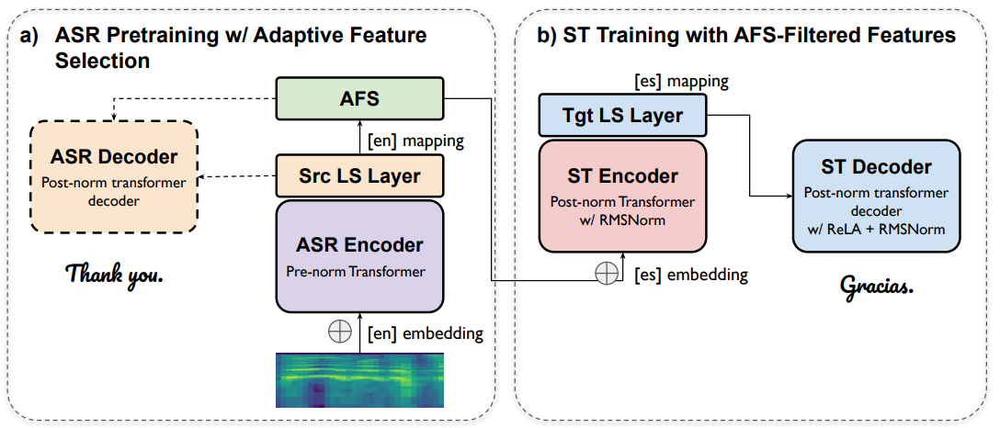

## Edinburgh's End-to-End Multilingual Speech Translation System for IWSLT 2021

[**Paper**](https://aclanthology.org/2021.iwslt-1.19/) | 
[**Highlights**](#paper-highlights) |
[**Results**](#results) |
[**Citation**](#citation)

### Paper highlights

We participated IWSLT21 multilingual speech translation with an integrated end-to-end system. Below shows the overview of our
system:



For more details, please check out [our paper](https://aclanthology.org/2021.iwslt-1.19/).


### Results

We release our system and outputs at [here](http://data.statmt.org/bzhang/iwslt2021_uoe_system/) to facilitate other researches, particularly for those who are interested in a 
reproduction and comparision.


### Citation

Please consider cite our paper as follows:
>Biao Zhang; Rico Sennrich (2021). Edinburgh's End-to-End Multilingual Speech Translation System for IWSLT 2021. In Proceedings of the 18th International Conference on Spoken Language Translation (IWSLT 2021). 
```
@inproceedings{zhang-sennrich-2021-edinburghs,
    title = "{E}dinburgh{'}s End-to-End Multilingual Speech Translation System for {IWSLT} 2021",
    author = "Zhang, Biao  and
      Sennrich, Rico",
    booktitle = "Proceedings of the 18th International Conference on Spoken Language Translation (IWSLT 2021)",
    month = aug,
    year = "2021",
    address = "Bangkok, Thailand (online)",
    publisher = "Association for Computational Linguistics",
    url = "https://aclanthology.org/2021.iwslt-1.19",
    doi = "10.18653/v1/2021.iwslt-1.19",
    pages = "160--168",
    abstract = "This paper describes Edinburgh{'}s submissions to the IWSLT2021 multilingual speech translation (ST) task. We aim at improving multilingual translation and zero-shot performance in the constrained setting (without using any extra training data) through methods that encourage transfer learning and larger capacity modeling with advanced neural components. We build our end-to-end multilingual ST model based on Transformer, integrating techniques including adaptive speech feature selection, language-specific modeling, multi-task learning, deep and big Transformer, sparsified linear attention and root mean square layer normalization. We adopt data augmentation using machine translation models for ST which converts the zero-shot problem into a zero-resource one. Experimental results show that these methods deliver substantial improvements, surpassing the official baseline by {\textgreater} 15 average BLEU and outperforming our cascading system by {\textgreater} 2 average BLEU. Our final submission achieves competitive performance (runner up).",
}
```