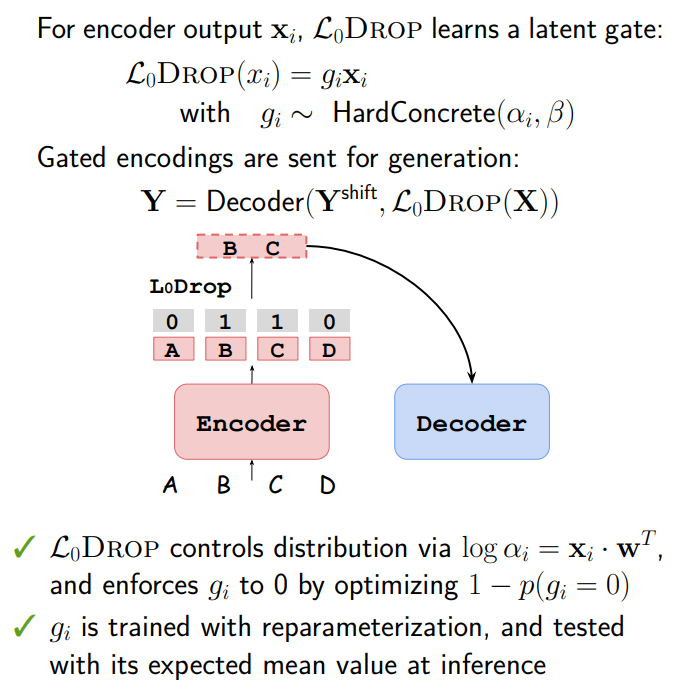
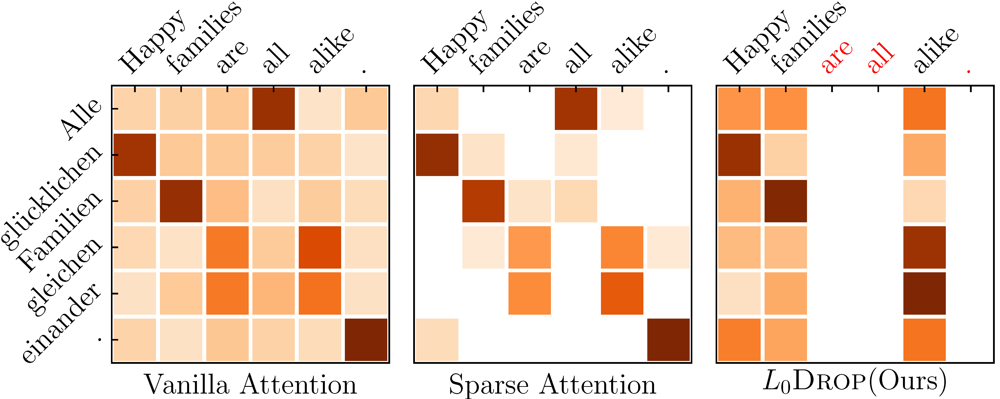
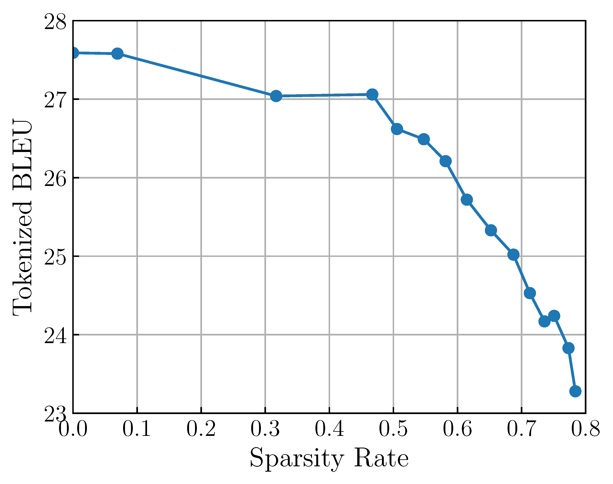

## On Sparsifying Encoder Outputs in Sequence-to-Sequence Models

[**Paper**](https://aclanthology.org/2021.findings-acl.255/) | 
[**Highlights**](#paper-highlights) |
[**Overview**](#overview) |
[**CaseStudy**](#examples) |
[**Training&Eval**](#training-and-evaluation) |
[**Citation**](#citation)

### Paper Highlights

Information is not uniformly distributed in sentences, while 

Standard encoder-decoder models for sequence-to-sequence learning always feed all encoder outputs to the decoder for 
generation. However, information in a sequence is not uniformly distributed over tokens. In translation, we have null
alignments where some source tokens are not translated at all; and in summarization, source document often contains many
redundant tokens. The research questions we are interested in:

* Are encoder outputs compressible?
* Can we identify those uninformative outputs and prune them out automatically?
* Can we obtain higher inference speed with shortened encoding sequence?

We propose L0Drop to this end, and our main findings are as follows:

* We confirm that the encoder outputs can be compressed, around 40-70% of them can be dropped without large effects on 
the generation quality.
* The resulting sparsity level differs across word types, the encodings corresponding to function words 
(such as determiners, prepositions) are more frequently pruned than those of content words (e.g., verbs and nouns).
* L0Drop can improve decoding efficiency particularly for lengthy source inputs. We achieve a decoding speedup of up to 
1.65x on document summarization tasks and 1.20x on character-based machine translation task.
* Filtering out source encodings with rule-based sparse patterns is also feasible.


### L0Drop

L0Drop forces model to route information through a subset of the encoder outputs, and the subset is learned automatically.



L0Drop is different from sparse attention, which is comparably shown below.



Note that L0Drop is data-driven and task-agnostic. We applied it to machine translation as well as 
document summarization tasks. Results on WMT14 En-De translation tasks are shown below:



Please refer to [our paper](https://aclanthology.org/2021.findings-acl.255/) for more details.

### Examples

Here, we show some examples learned by L0Drop on machine translation tasks (highlighted source words are dropped after encoding):

| Task           | Sample                                                                                                                                                                                                                                                                                                                                                                                            |
|----------------|---------------------------------------------------------------------------------------------------------------------------------------------------------------------------------------------------------------------------------------------------------------------------------------------------------------------------------------------------------------------------------------------------|
|    WMT18 Zh-En | Source `这` 一年 `来` `，` 中国 电@@ 商 出 `了` `一份` 怎样 `的` 成绩@@ 单 ？ <br/> Reference: what sort of report card did China &apos;s e @-@ commerce industry receive this year ? <br/> Translation: what kind of report card was produced by Chinese telec@@ om dealers during the year ?                                                                                                                |
|                | Source: 中国 `在` 地区 合作 `中` `发挥` `的` 作用 一贯 `是` 积极 正面 `的` `，` `受到` 地区 国家 高度 认可 `。` <br/> Reference: China has always played an active and positive role in regional cooperation , which is well recognized by regional countries . <br/> Translation: China &apos;s role in regional cooperation has always been positive and highly recognized by the countries of the region . |
|    WMT14 En-De | Source: `The` cause `of` `the` b@@ `last` `was` not known `,` he said `.` <br/> Reference: Die Ursache der Explo@@ sion sei nicht bekannt , erklärte er . <br/> Translation: Die Ursache der Explo@@ sion war nicht bekannt , sagte er .                                                                                                                                                                      |
|                | Source: `The` night `was` long , `the` music loud and `the` atmosphere good `,` but `at` some `point` everyone has `to` go home `.` <br/> Reference: Die Nacht war lang , die Musik laut und die Stimmung gut , aber irgendwann geht es nach Hause . <br/> Translation: Die Nacht war lang , die Musik laut und die Atmosphäre gut , aber irgendwann muss jeder nach Hause gehen .                            |


### Training and Evaluation

- We implement the model in [transformer_l0drop](../../models/transformer_l0drop.py) and [l0norm](../../modules/l0norm.py)

#### Training

It's possible to train Transformer with L0Drop from scratch by setting proper schedulers for `\lambda`, 
a hyper-parameter loosely controlling the sparsity rate of L0Drop. Unfortunately, the optimal scheduler is
data&task-dependent.

We suggest first pre-train a normal Transformer model, and then finetune the Transformer+L0Drop. This could
save a lot of efforts.

* Step 1. train a normal Transformer model as described [here](../../docs/usage/README.md). Below is 
an example on WMT14 En-De for reference:
```
data_dir=the preprocessed data diretory
zero=the path of this code base
python $zero/run.py --mode train --parameters=hidden_size=512,embed_size=512,filter_size=2048,\
dropout=0.1,label_smooth=0.1,attention_dropout=0.1,\
max_len=256,batch_size=80,eval_batch_size=32,\
token_size=6250,batch_or_token='token',\
initializer="uniform_unit_scaling",initializer_gain=1.,\
model_name="transformer",scope_name="transformer",buffer_size=60000,\
clip_grad_norm=0.0,\
num_heads=8,\
lrate=1.0,\
process_num=3,\
num_encoder_layer=6,\
num_decoder_layer=6,\
warmup_steps=4000,\
lrate_strategy="noam",\
epoches=5000,\
update_cycle=4,\
gpus=[0],\
disp_freq=1,\
eval_freq=5000,\
sample_freq=1000,\
checkpoints=5,\
max_training_steps=300000,\
beta1=0.9,\
beta2=0.98,\
epsilon=1e-8,\
random_seed=1234,\
src_vocab_file="$data_dir/vocab.zero.en",\
tgt_vocab_file="$data_dir/vocab.zero.de",\
src_train_file="$data_dir/train.32k.en.shuf",\
tgt_train_file="$data_dir/train.32k.de.shuf",\
src_dev_file="$data_dir/dev.32k.en",\
tgt_dev_file="$data_dir/dev.32k.de",\
src_test_file="$data_dir/newstest2014.32k.en",\
tgt_test_file="$data_dir/newstest2014.de",\
output_dir="train"
```

* Step 2. finetune L0Drop using the following command:
```
data_dir=the preprocessed data directory
zero=the path of this code base
python $zero/run.py --mode train --parameters=\
l0_norm_reg_scalar=0.3,\
l0_norm_warm_up=False,\
model_name="transformer_l0drop",scope_name="transformer",\
pretrained_model="path-to-pretrained-transformer",\
max_training_steps=320000,\
src_vocab_file="$data_dir/vocab.zero.en",\
tgt_vocab_file="$data_dir/vocab.zero.de",\
src_train_file="$data_dir/train.32k.en.shuf",\
tgt_train_file="$data_dir/train.32k.de.shuf",\
src_dev_file="$data_dir/dev.32k.en",\
tgt_dev_file="$data_dir/dev.32k.de",\
src_test_file="$data_dir/newstest2014.32k.en",\
tgt_test_file="$data_dir/newstest2014.de",\
output_dir="train"
```
where `l0_norm_reg_scalar` is the `\lambda`, and `0.2 or 0.3` is a nice hyperparameter in our experiments.

#### Evaluation

The evaluation follows the same procedure as the baseline Transformer.

### Citation

Please consider cite our paper as follows:
>Biao Zhang; Ivan Titov; Rico Sennrich (2021). On Sparsifying Encoder Outputs in Sequence-to-Sequence Models. Findings of the Association for Computational Linguistics: ACL-IJCNLP 2021. 
```
@inproceedings{zhang-etal-2021-sparsifying,
    title = "On Sparsifying Encoder Outputs in Sequence-to-Sequence Models",
    author = "Zhang, Biao  and
      Titov, Ivan  and
      Sennrich, Rico",
    booktitle = "Findings of the Association for Computational Linguistics: ACL-IJCNLP 2021",
    month = aug,
    year = "2021",
    address = "Online",
    publisher = "Association for Computational Linguistics",
    url = "https://aclanthology.org/2021.findings-acl.255",
    doi = "10.18653/v1/2021.findings-acl.255",
    pages = "2888--2900",
}

```

