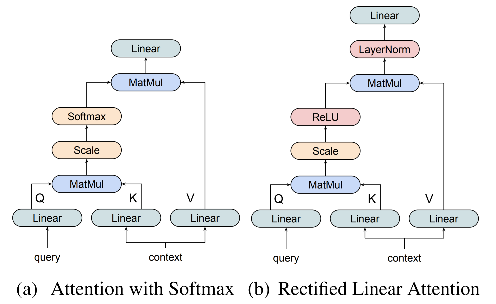
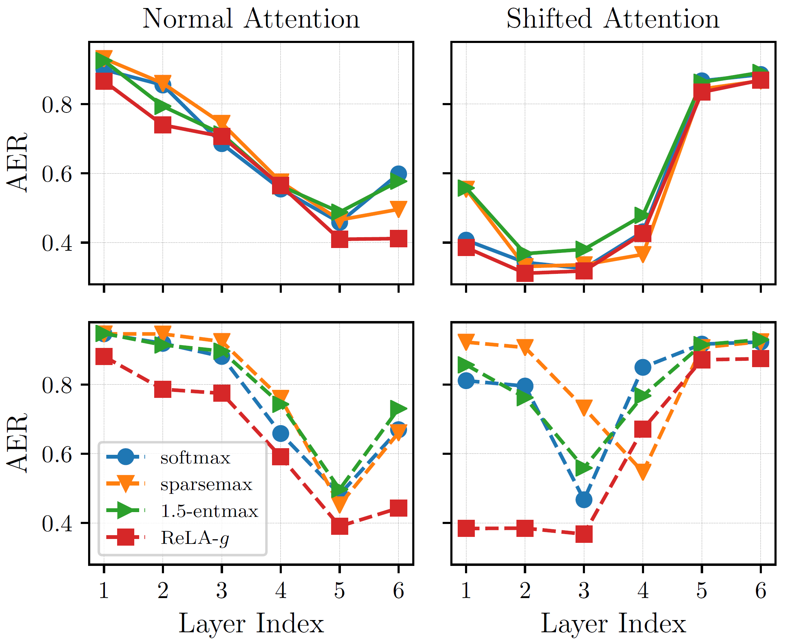
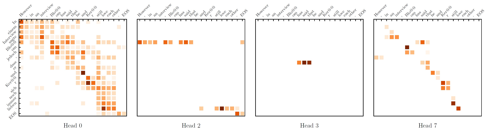

## Sparse Attention with Linear Units, EMNLP2021


[**Paper**](https://arxiv.org/abs/2104.07012/) | 
[**Highlights**](#paper-highlights) |
[**Training**](#model-training) |
[**Results**](#results) |
[**Citation**](#citation)


### Paper highlights

Attention contributes substantially to NMT/NLP. It relies on `SoftMax` activation to produce a dense, categorical 
distribution as an estimation of the relevance between input query and contexts. 

**But why dense? and Why distribution?**


* Low attention score in dense attention doesn't mean low relevance. By contrast, sparse attention often does better.
* Attention scores estimate the relevance, which doesn't necessarily follow distribution albeit such normalization 
often stabilize the training.


In this work, we propose rectified linear attention (ReLA), which directly uses ReLU rather than 
softmax as an activation function for attention scores. ReLU naturally leads to sparse attention, and we
apply [RMSNorm](https://openreview.net/pdf?id=BylmcHHgIB) to attention outputs to stabilize model training. Below
shows the difference between ReLA and the vanilla attention.



We find that:
* ReLA achieves comparable translation performance to the softmax-based attention on five translation tasks, with 
similar running efficiency, but faster than other sparse baselines.
* ReLA delivers high sparsity rate, high head diversity, and better accuracy than all baselines with respect to 
word alignment. 
* We also observe the emergence of attention heads with a high rate of null attention, only activating for certain queries.


### Model Training

- We implement the model in [transformer_rela](../../models/transformer_rela.py) and [ReLA](../../modules/rela.py)

The training of `ReLA` follows the baseline. You just need to change the `model_name` to `transformer_rela` as below 
(take WMT14 En-De as example):
```
data_dir=the preprocessed data diretory
zero=the path of this code base
python $zero/run.py --mode train --parameters=hidden_size=512,embed_size=512,filter_size=2048,\
dropout=0.1,label_smooth=0.1,attention_dropout=0.1,\
max_len=256,batch_size=80,eval_batch_size=32,\
token_size=6250,batch_or_token='token',\
initializer="uniform_unit_scaling",initializer_gain=1.,\
model_name="transformer_rela",scope_name="transformer_rela",buffer_size=60000,\
clip_grad_norm=0.0,\
num_heads=8,\
lrate=1.0,\
process_num=3,\
num_encoder_layer=6,\
num_decoder_layer=6,\
warmup_steps=4000,\
lrate_strategy="noam",\
epoches=5000,\
update_cycle=4,\
gpus=[0],\
disp_freq=1,\
eval_freq=5000,\
sample_freq=1000,\
checkpoints=5,\
max_training_steps=300000,\
beta1=0.9,\
beta2=0.98,\
epsilon=1e-8,\
random_seed=1234,\
src_vocab_file="$data_dir/vocab.zero.en",\
tgt_vocab_file="$data_dir/vocab.zero.de",\
src_train_file="$data_dir/train.32k.en.shuf",\
tgt_train_file="$data_dir/train.32k.de.shuf",\
src_dev_file="$data_dir/dev.32k.en",\
tgt_dev_file="$data_dir/dev.32k.de",\
src_test_file="$data_dir/newstest2014.32k.en",\
tgt_test_file="$data_dir/newstest2014.de",\
output_dir="train"
```


### Results

* Translation performance (SacreBLEU Scores) on different WMT tasks 

|    Model   | WMT14 En-Fr | WMT18 En-Fi | WMT18 Zh-En | WMT16 Ro-En |
|:----------:|:-----------:|:-----------:|:-----------:|:-----------:|
|   softmax  |     37.2    |     15.5    |     21.1    |     32.7    |
|  sparsemax |     37.3    |     15.1    |     19.2    |     33.5    |
| 1.5-entmax |     37.9    |     15.5    |     20.8    |     33.2    |
|    ReLA    |     37.9    |     15.4    |     20.8    |     32.9    |

* Training and decoding efficiency of ReLA (based on tensorflow 1.13)

|    Model   | Params | Train Speedup | Decode Speedup |
|:----------:|:------:|:-------------:|:--------------:|
|   softmax  | 72.31M |     1.00x     |      1.00x     |
|  sparsemax | 72.31M |     0.26x     |      0.54x     |
| 1.5-entmax | 72.31M |     0.27x     |      0.49x     |
|    ReLA    | 72.34M |     0.93x     |      0.98x     |


* Source-target attention of ReLA aligns better with word alignment



Note solid curves are for best head per layer, while dashed curves are average results over heads.

* ReLA enables null-attention: attend to nothing




### Citation

Please consider cite our paper as follows:
>Biao Zhang; Ivan Titov; Rico Sennrich (2021). Sparse Attention with Linear Units. In The 2021 Conference on Empirical Methods in Natural Language Processing. Punta Cana, Dominican Republic
```
@inproceedings{zhang-etal-2021-sparse,
    title = "Sparse Attention with Linear Units",
    author = "Zhang, Biao  and
      Titov, Ivan  and
      Sennrich, Rico",
    booktitle = "The 2021 Conference on Empirical Methods in Natural Language Processing",
    month = nov,
    year = "2021",
    address = "Punta Cana, Dominican Republic",
    publisher = "Association for Computational Linguistics",
    eprint = "2104.07012"
}
```
